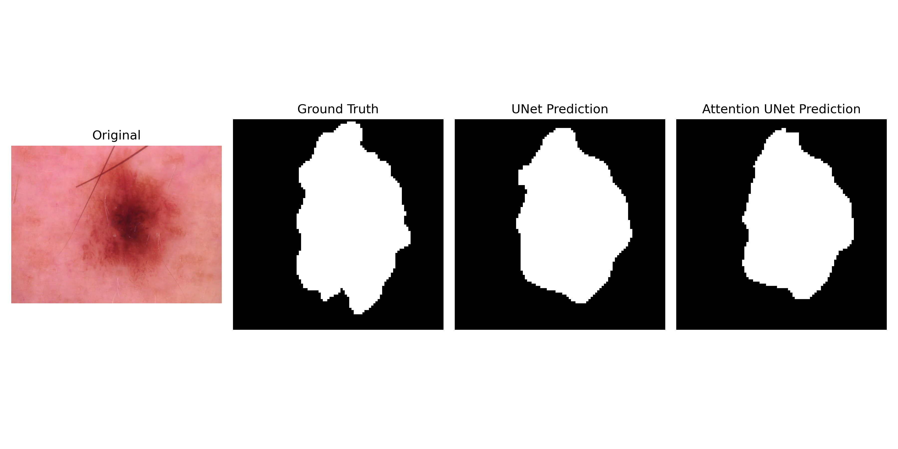
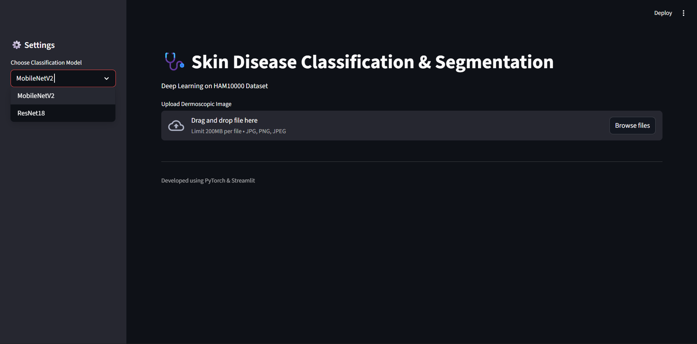
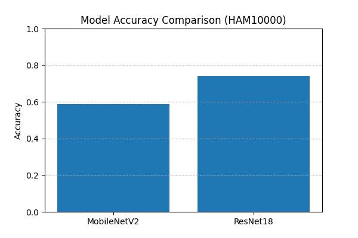
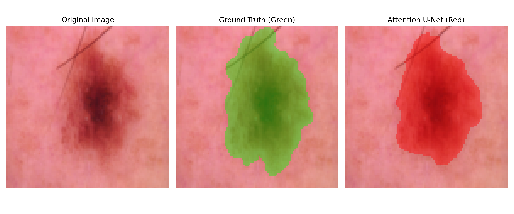
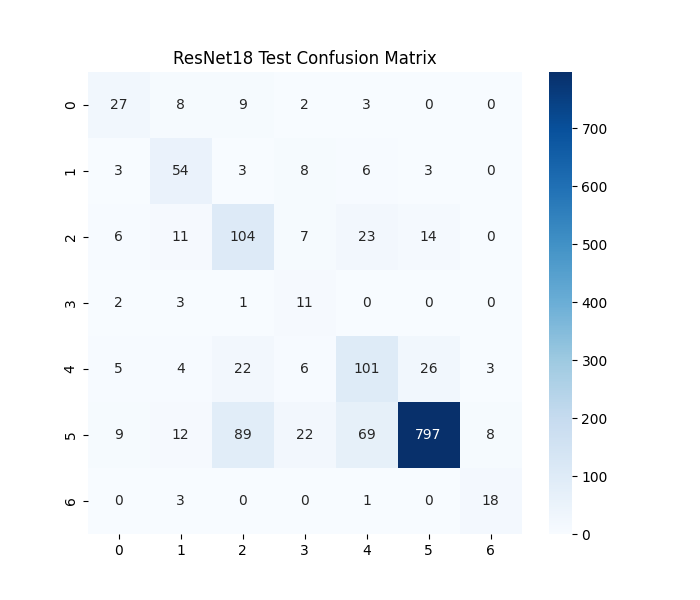

# Skin Disease Classification & Lesion Segmentation using Deep Learning

  
   
  <em>Figure 1: End-to-End Pipeline Visualization. (Left to Right: Original Input, Ground Truth, UNet Prediction, Attention UNet Prediction.)</em>

## 📌 Executive Summary

This project implements a sophisticated, dual-stage deep learning pipeline designed to assist dermatologists in analyzing skin lesions. The system addresses two critical challenges using the **HAM10000 dataset**:

1.  **Multi-Class Classification:** Distinguishing between 7 types of skin diseases (e.g., Melanoma vs. Benign Keratosis).
2.  **Semantic Segmentation:** Precisely isolating the affected lesion area from the surrounding skin.

By integrating **Attention Mechanisms** into standard segmentation architectures, this project achieves a baseline that balances accuracy with model interpretability.

## 🚀 Key Highlights & Impact

* **76% Classification Accuracy:** Achieved using a fine-tuned ResNet18 architecture.
* **High Segmentation Precision (0.88 Dice Coeff):** The Attention U-Net model successfully handles brightness variations and noise (like hair) better than standard configurations.
* **Class Imbalance Mitigation:** Implemented specific loss functions and sampling techniques to address the dominant 'nevus' class.
* **Ready-to-Use UI:** Includes a functional Streamlit interface for uploading and visualizing predictions (even if the pre-trained weights need reloading).

  
   
  <em>Figure 2: Streamlit Application Interface for medical professionals.</em>

---

## 🛠️ Model Architecture & Technical Breakdown

This project systematically compared several state-of-the-art (SOTA) architectures to find the optimal balance of efficiency and accuracy.

### 1️⃣ Classification: Transfer Learning

I utilized Transfer Learning with pre-trained weights from ImageNet to overcome data scarcity and accelerate convergence.

| Model | Accuracy | Strengths |
| :--- | :--- | :--- |
| **ResNet18** | **76%** | Deeper feature extraction, strong performance on complex structures. |
| **MobileNetV2** | 70% | Highly efficient, designed for resource-constrained systems (Edge AI potential). |

  
   
  <em>Figure 3: Classification Accuracy Comparison (ResNet18 vs. MobileNetV2).</em>

### 2️⃣ Segmentation: Attention Gates

Standard U-Net can struggle when the background is noisy (e.g., skin texture, hair) or when the lesion has poor contrast. To solve this, I implemented an **Attention U-Net**, which uses specialized gates to suppress irrelevant regions and highlight salient features (the lesion) during feature extraction.

   
   
  <em>Figure 4: Visual Overlay Comparison. Standard U-Net (Left) vs. Attention U-Net (Right) isolating the lesion.</em>

---

## 📊 Evaluation Metrics & Discussion

### 1. Handling Class Imbalance (Classification)

The HAM10000 dataset is highly skewed toward the "nevus" (nv) class. To ensure the model learned rare classes (like Melanoma), I implemented **Balanced Sampling** during training and utilized **Weighted Cross-Entropy Loss**.

The confusion matrix shows the resulting robustness, successfully identifying instances of rare diseases that a vanilla optimizer would have missed.

  
   
  <em>Figure 5: ResNet18 Confusion Matrix. Demonstrating model performance across 7 classes despite skew.</em>

### 2. Segmentation Performance

The Attention U-Net outperformed the standard U-Net on critical segmentation metrics, especially maintaining high **Dice Coefficients** and **IoU** under varied lighting conditions.

| Condition | Dice | IoU | Precision | Recall |
| :--- | :---: | :---: | :---: | :---: |
| **Normal** | 0.885 | 0.818 | 0.918 | 0.881 |
| **Brightness Variation** | **0.891** | **0.820** | 0.885 | **0.924** |

---

## 🔮 Future Scope & Evolution (2026 Outlook)

This project serves as a strong foundation. If I were to revisit and optimize this for current (2026) state-of-the-art standards, I would implement:

1.  **Vision Transformers (ViTs):** Replace standard CNN encoders (ResNet/MobileNet) with Transformer blocks (e.g., Swin Transformer) for superior capture of global contextual dependencies, which are vital for nuanced medical classification.
2.  **Federated Learning:** Integrate this model into a federated pipeline, allowing different hospitals to contribute data for model refinement without exposing sensitive patient health information (PHI), addressing critical data privacy concerns in modern healthcare.

---

## 🗂️ Dataset Details

**Source:** The HAM10000 Dataset via Tschandl et al.
**Total Images:** 10,015 Dermoscopic images.

| Class | Description |
| :--- | :--- |
| `akiec` | Actinic Keratoses |
| `bcc` | Basal Cell Carcinoma |
| `bkl` | Benign Keratosis |
| `df` | Dermatofibroma |
| `mel` | Melanoma |
| `nv` | Melanocytic Nevus (Dominant Class) |
| `vasc` | Vascular Lesions |

---

## ⚙️ Tech Stack & Structure

* **Deep Learning:** PyTorch, Torchvision
* **Deployment:** Streamlit (UI)
* **Analytics:** NumPy, Pandas, Scikit-learn, Matplotlib, Seaborn

### Project Structure
skin-disease-classification/
│
├── classification/        # Training/Inference scripts for ResNet/MobileNet
├── segmentation/          # Training/Inference scripts for U-Net/Attention U-Net
├── data/                  # Placeholder for images, masks, and metadata
├── app.py                 # Streamlit Web Application
├── requirements.txt       # Dependencies
└── SHIVA_Skin_Disease_report.pdf # Academic Report

🛠️ Getting Started
Clone the Repo:

Bash
git clone [https://github.com/ShivaManiV2/skin-disease-classification.git](https://github.com/ShivaManiV2/skin-disease-classification.git)
cd skin-disease-classification
Install Dependencies:

Bash
pip install -r requirements.txt
Run the UI (requires model retraining):

Bash
streamlit run app.py

👨‍💻 Author
Developed as part of a Data Science / Computer Vision academic project by Shivamaniteja Boini.
[Connect with me on LinkedIn](https://www.linkedin.com/in/boini-shivamaniteja)
